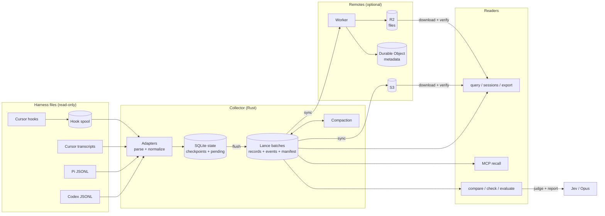

# Harness Durable

Capture Codex, Pi, and Cursor sessions into portable [Lance](https://github.com/lance-format/lance) datasets. Query them locally, sync them to S3 or Cloudflare R2, and compare agent runs against accepted references.

## Data flow



1. Adapters read new bytes from session files and write records and events to SQLite with the source checkpoint, all in one transaction.
2. A flush writes pending data as an immutable Lance batch, then publishes it with an atomic rename.
3. Compaction merges small batches. The merged batch lists the batches it replaces.
4. `sync` uploads batches. S3 uses conditional writes. The Worker stores files in R2 and publication state in a Durable Object.
5. Readers scan Lance locally. Remote readers download and verify each batch first.

## Quick start

Requires Rust 1.91+, a C/C++ toolchain, and `protoc`.

```sh
cargo build --release --locked
export PATH="$PWD/target/release:$PATH"

harness-durable --state-dir /tmp/demo import --harness pi --path tests/fixtures/pi.jsonl
harness-durable --state-dir /tmp/demo sessions
harness-durable --state-dir /tmp/demo query --kind tool_result --format jsonl
```

## Commands

| Command | Purpose |
| --- | --- |
| `discover` | List session files found on this machine |
| `import` / `watch` | Capture once, or continuously |
| `sync` | Upload batches to configured remotes |
| `status` / `sessions` / `query` / `export` | Read the archive |
| `compact` | Merge small batches (`watch` does this too) |
| `compare` / `snapshot` / `check` | Compare a run with a reference; gate regressions in CI |
| `label` / `labels` / `evaluate` / `calibrate` | Human labels and accepted oracles |
| `browse` / `mcp` | Terminal browser and read-only MCP recall server |
| `hooks install cursor` | Capture Cursor tool results live |

Run `harness-durable <command> --help` for options.

## Configuration

Default config is `~/.harness-durable/config.toml`. See [config.example.toml](config.example.toml) for sources, remotes, batch and compaction limits, and model settings.

## Tests

```sh
cargo fmt --check && cargo clippy --locked --all-targets -- -D warnings && cargo test --locked
cd worker && npm ci && npm run typecheck && npm test
```

## More

- [Full reference](docs/reference.md): formats, durability, remotes, Worker API, and evaluation details.
- [Architecture report (STE100)](docs/architecture-report-ste100.md)

Raw session text and tool output are archived as-is, with no redaction. Configure a remote only for storage you trust.
